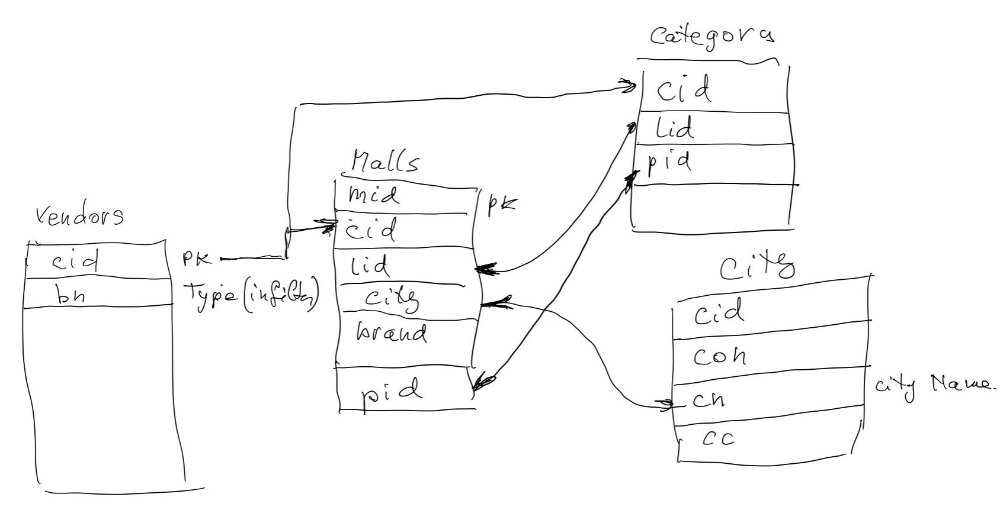
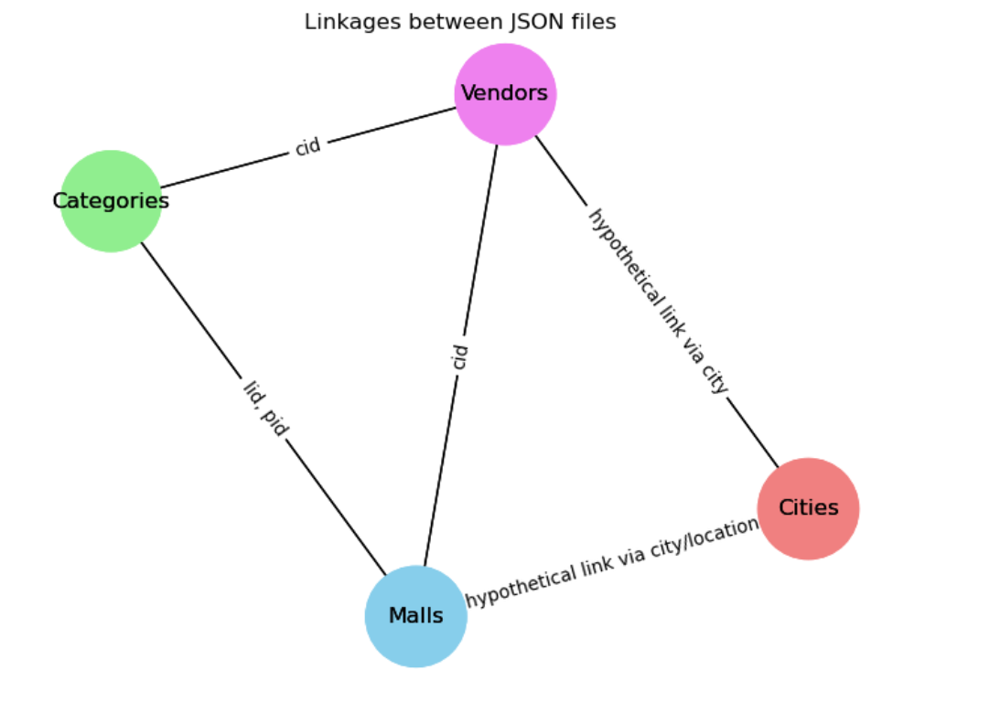
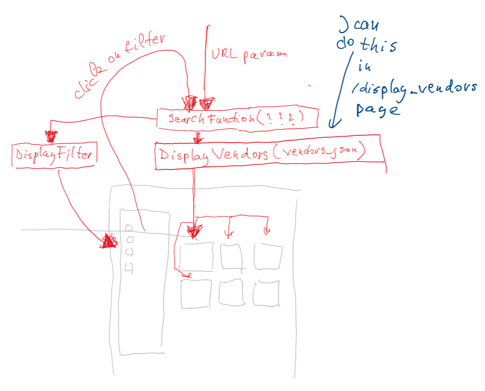

# Status from Marian

Today: May 10:

<!-- insert link to local md called data-analysis.md -->

[Link to data-analysis jupyter notebook](data_analysis.ipynb)

Data






---

Please take a look at this diagram.

I think the major problem is DisplayFilter and the interaction between filter and vendors display.
We can broke it down in small tasks. I can focus on DisplayVendors that will take as parameter a JSON of vendors that was produced by SearchFilter.



---

May 9:

I created a page for each api, in pages. They can be called like this:

```
http://localhost:3000/citylist
http://localhost:3000/vendorlist
http://localhost:3000/categorylist
http://localhost:3000/malllist
```

Parameters are hard-coded at this moment, with the exception of 'categorylist', which is using URL parameters. I wanted to see how I would do that. It can be called like this:

```
http://localhost:3000/categorylist?vendor_name=Houston&search_type=City
```

If no url parameters then will fall-back on the hardcoded values.

***I had to use a proxy page for each of the api, otherwise had CORS problems. Proxy API are in `/src/pages/api`***

I will continue after I wake up, with the operation that we talked about.

---

This is a [Next.js](https://nextjs.org/) project bootstrapped with [`create-next-app`](https://github.com/vercel/next.js/tree/canary/packages/create-next-app).

## Getting Started

First, run the development server:

```bash
npm run dev
# or
yarn dev
# or
pnpm dev
# or
bun dev
```

Open [http://localhost:3000](http://localhost:3000) with your browser to see the result.

You can start editing the page by modifying `app/page.tsx`. The page auto-updates as you edit the file.

This project uses [`next/font`](https://nextjs.org/docs/basic-features/font-optimization) to automatically optimize and load Inter, a custom Google Font.

## Learn More

To learn more about Next.js, take a look at the following resources:

- [Next.js Documentation](https://nextjs.org/docs) - learn about Next.js features and API.
- [Learn Next.js](https://nextjs.org/learn) - an interactive Next.js tutorial.

You can check out [the Next.js GitHub repository](https://github.com/vercel/next.js/) - your feedback and contributions are welcome!

## Deploy on Vercel

The easiest way to deploy your Next.js app is to use the [Vercel Platform](https://vercel.com/new?utm_medium=default-template&filter=next.js&utm_source=create-next-app&utm_campaign=create-next-app-readme) from the creators of Next.js.

Check out our [Next.js deployment documentation](https://nextjs.org/docs/deployment) for more details.
